---
## Front matter
lang: ru-RU
title: Лабораторная работа № 1
author:
  - Калашникова Д. В.
institute:
  - Российский университет дружбы народов, Москва, Россия
  
date: 05 сентября 2025

## i18n babel
babel-lang: russian
babel-otherlangs: english

## Formatting pdf
toc: false
toc-title: Содержание
slide_level: 2
aspectratio: 169
section-titles: true
theme: metropolis
header-includes:
 - \metroset{progressbar=frametitle,sectionpage=progressbar,numbering=fraction}
---

# Информация

## Докладчик

:::::::::::::: {.columns align=center}
::: {.column width="70%"}

  * Калашникова Дарья Викторовна
  * Российский университет дружбы народов
  * [1132243108@pfur.ru](mailto:1132243108@pfur.ru)

:::
::: {.column width="30%"}

:::
::::::::::::::

## Цель работы

Установить Linux Rocky и ознакомиться с его возможностями

## Задание

Установить ОС и выполнить домашнее задание

## Выбор диска

Для начала назовем нашу виртуальную машину и выберем место установки

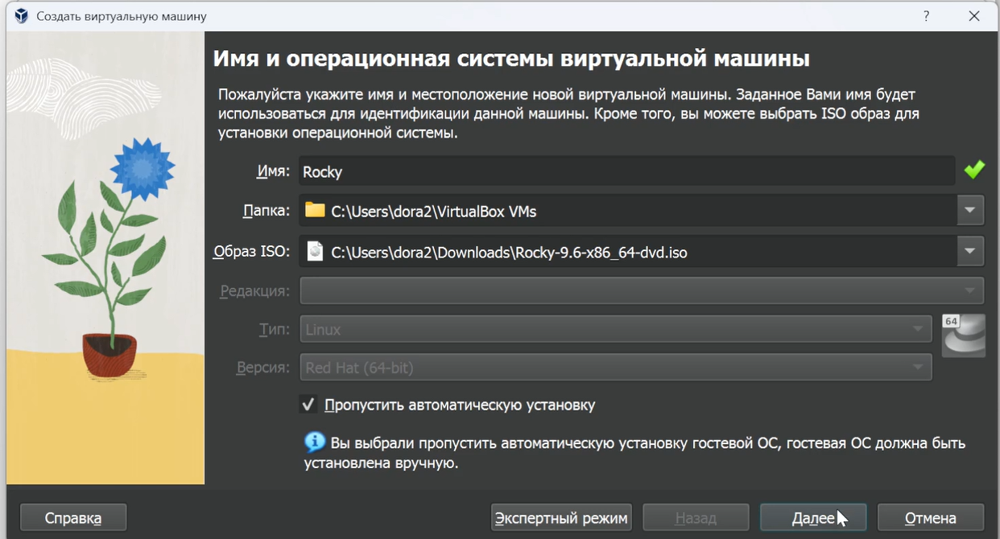{width=70%}

## Выделение памяти и процессоров

Выделяем основную память и процессоры 

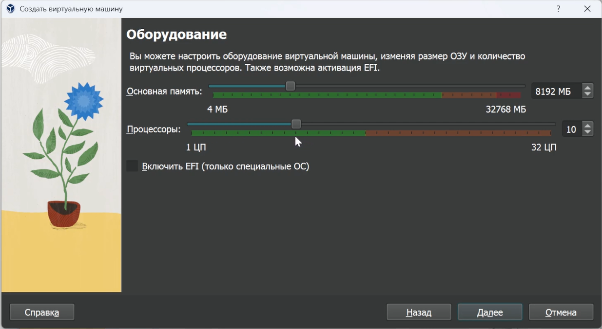{width=70%} 

## Выделение памяти для диска

Выделяем 40 ГБ для виртуального жесткого диска

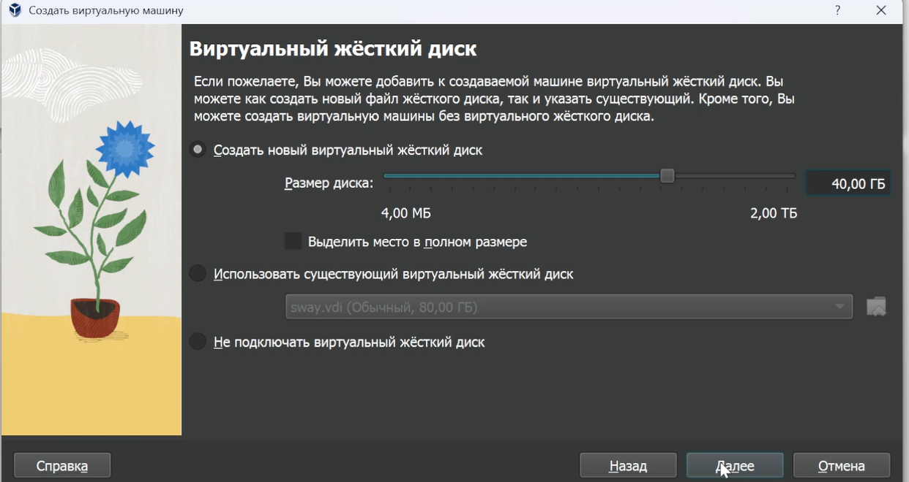{width=70%}

## Выбор языка

Выбираем английский язык для интерфейса 

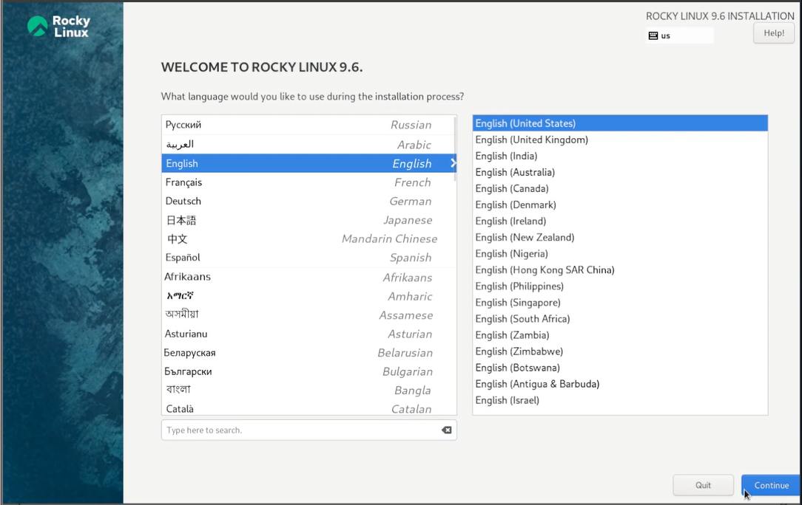{width=60%}

## Отключение KDUMP

Отключаем KDUMP 

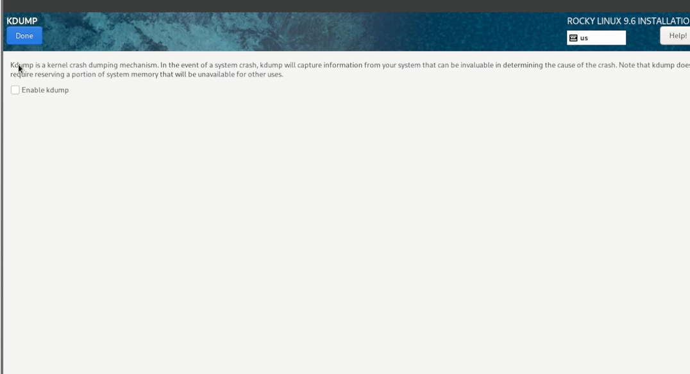{width=70%}

## Окно настройки установки

Далее мы устанавливаем настройки: выбор программ 

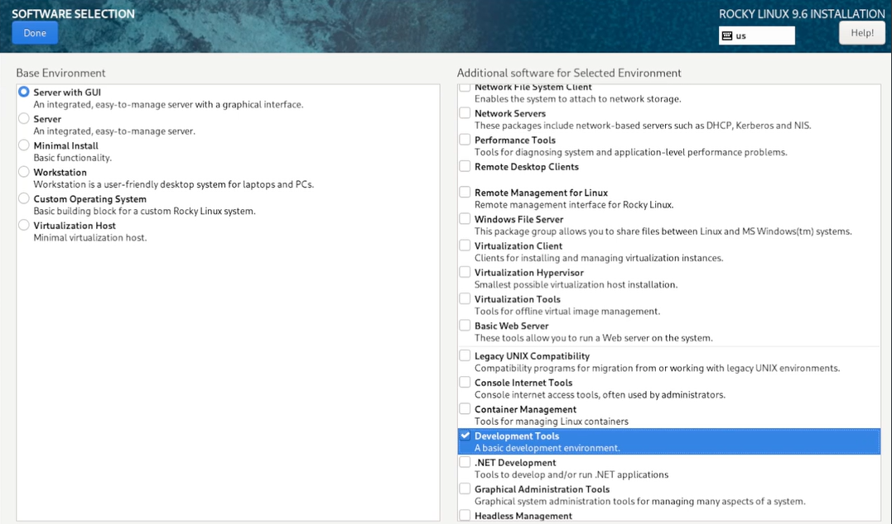{width=70%}

## Окно с местом установки

Теперь мы выбираем место установки диска 

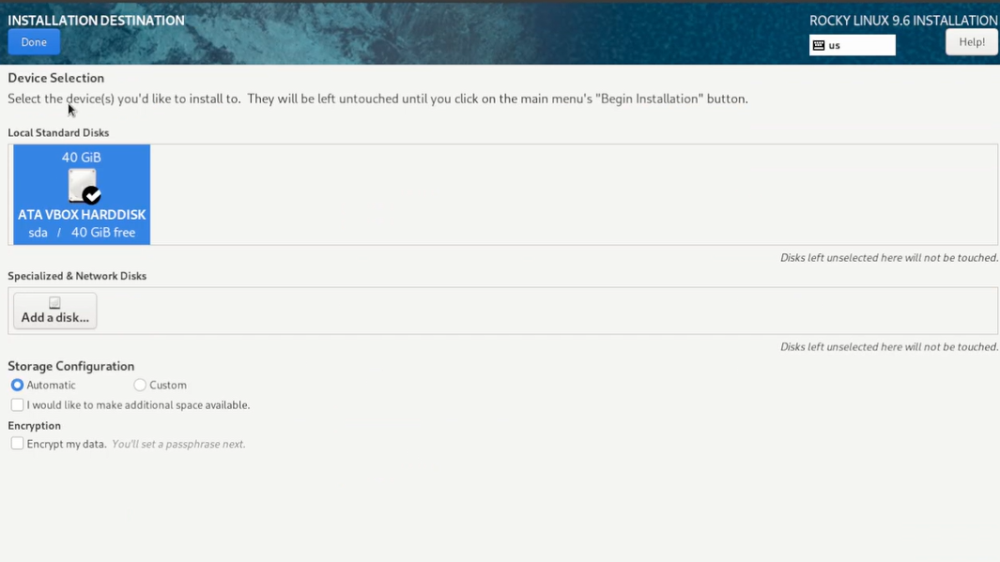{width=70%}

## Окно настройки установки сети и имени узла

Включаем сетевое соединение с именем узла dvkalashnikova.localdomain 

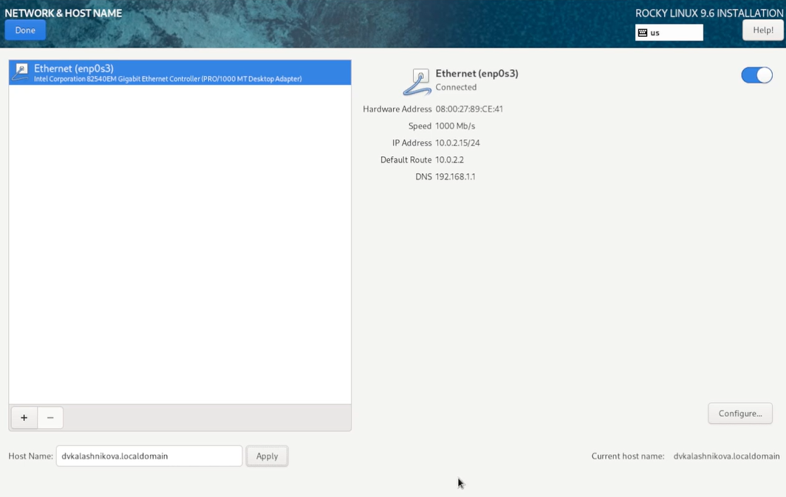{width=60%}

## Установка пароля для root

Устанавливаем пароль для root и разрешение на ввод пароля root при использовании SSH 

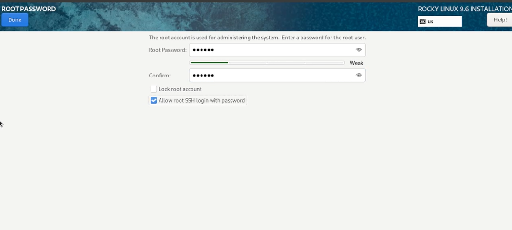{width=50%}

## Установка пароля для пользователя с правами администратора

Задаем локального пользователя с правами администратора 

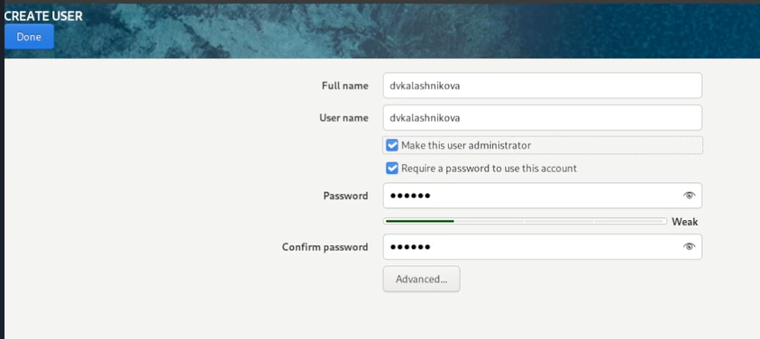{width=50%}

## Установка

Далее нажимаем Begin Installation для установки 

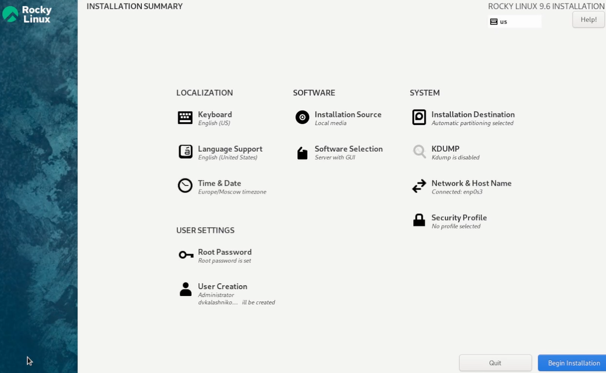{width=70%}

## Завершение установки

Завершение установки ОС 

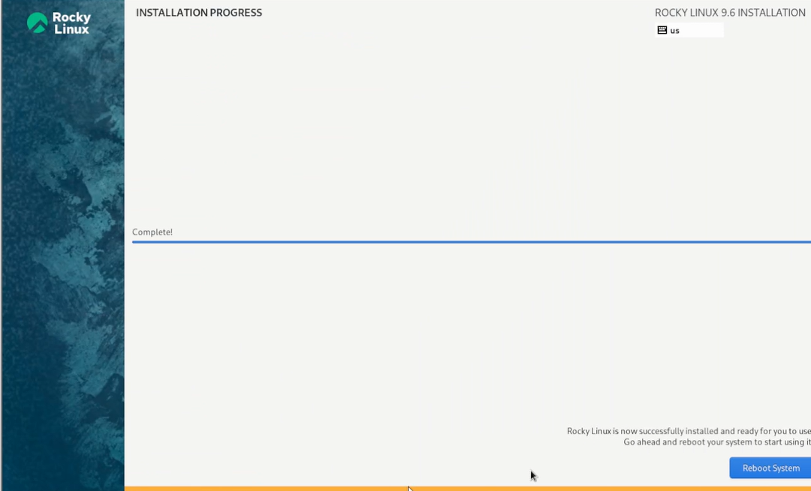{width=70%}

## Подключение дополнительного образа диска гостевой ОС

Дальше нужно подключить образ диска дополнительной гостевой ОС 

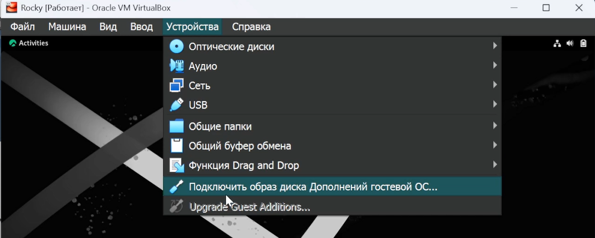{width=70%}

## Запуск дополнительного образа диска гостевой ОС

Теперь мы запускаем образ этого диска 

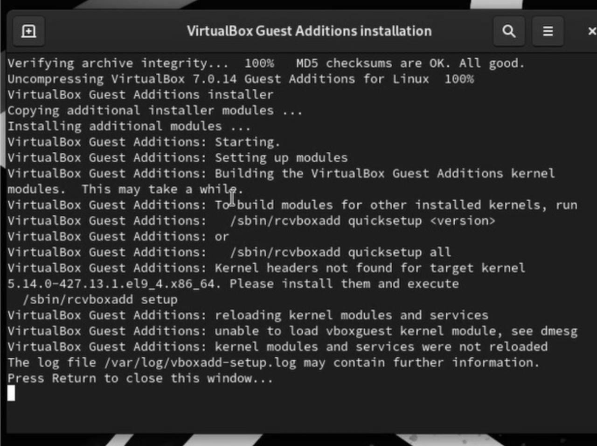{width=50%}

## Версия ядра Linux

Далее приступаем к выполнению домашнего задания

Получаем информацию о версии ядра Linux (Linux version) 

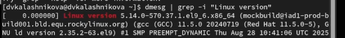{width=70%}

## Частота процессора

Получаем информацию о частоте процессора (Detected Mhz processor) 

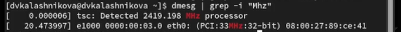{width=70%}

## Модель процессора

Получаем информацию о моделе процессора (CPU0)

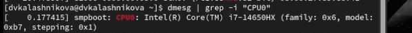{width=70%}

## Объем доступной оперативной памяти

Получаем информацию об бъеме доступной оперативной памяти (Memory available) 

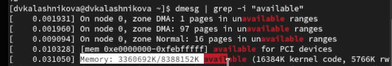{width=70%}

## Тип обнаруженного гипервизора

Получаем информацию о типе обнаруженного гипервизора (Hypervisor detected) 

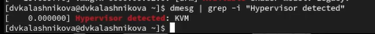{width=70%}

## Тип файловой системы и последовательность монтирования

Получаем информацию о типе файловой системы корневого раздела (XFS) и последовательность монтирования файловых систем 

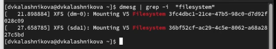{width=70%}

## Выводы

В результате выполнения работы была установлена система

